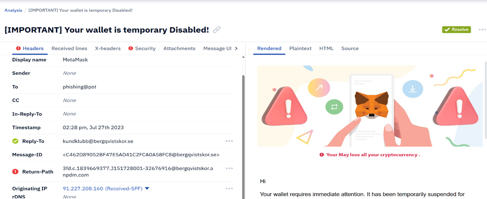

Subject: Your wallet is temporary Disabled!

This email claims to notify the recipient of a temporary suspension on their digital wallet due to security reasons, It urges the user to take immediate action to restore access and avoid potential loss of funds. The message also includes a link for what it calls a manual upgrade and sets a deadline for compliance.

Below is the phishing email analysis of this email with provided screenshot

E-mail Analysis

1. Header Analysis

From: kundklubb@bergqvistskor.se
The email claims to be from MetaMask, but the domain in this email address is bergqvistskor.se, which is completely unrelated to MetaMask. In fact, the domain name belongs to a Swedish shoe company,not a cryptocurrency wallet provider.

Email Samples/Images/Sample1/header analysis 1.png

 
Return-Path:
3fd.c.1839669377.J151728001-32676916@bergqvistskor.anpdm.com , this return path is from a marketing platform (anpdm), not MetaMask or anything crypto-related. This mismatch is a common phishing trick.

![Image Alt]Images/Sample1/Return Path 1.png)
 
Originating IP:
91.227.208.160 , even though it passed SPF, it has no reverse DNS (rDNS), meaning the IP isn't tied to a verified domain. This is unusual for trusted services and is common with suspicious senders.

![Image Alt]Images/Sample1/Originating IP 1.png)	

Email Security

![Image Alt]Images/Sample1/Email Security 1.png)

 
SPF: Pass
SPF (Sender Policy Framework) checks if the sending IP is allowed to send for the domain. It passed, but since this domain isn’t related to MetaMask at all, it just means it’s authorized for that brand, not that the content is safe.

DKIM:  Neutral
DKIM (DomainKeys Identified Mail) helps confirm the email wasn’t tampered with during sending. The verification was neutral, meaning it wasn’t fully valid. That can either be from poor setup or intentional content changes.

DMARC:  None
DMARC (Domain-based Message Authentication, Reporting and Conformance) tells mail servers how to handle spoofed messages. With no DMARC record, spoofing is much easier. A secure sender would have one.

2. Content of the Email
Subject: Your wallet is temporary Disabled!
The subject itself contains a grammatical error, temporary instead of temporarily, which is a common overlooked sign in phishing attempts.

Message Body:
Hi,
Your wallet requires immediate attention. It has been temporarily suspended for security reasons. To safeguard your assets and prevent permanent removal from our system, please upgrade your wallet before July 30th.
If you do not upgrade by the given deadline, you may permanently lose all your cryptocurrency holdings...

This is a typical phishing format. The tone is threatening, playing on fear and urgency. 
Real service providers don’t make high-stakes warnings like this over emails, especially not with bad English or from unrelated domains.
 

![Image Alt]Images/Sample1/Content of Mail 1.png)

3. Attachment / Link

Attachment: None.
URL in message:
Domain: one-lnk.com
Path: Long and obfuscated, commonly used for hiding redirection or phishing pages.
VirusTotal: 0/90 detections but not being flagged yet doesn’t make it safe. The setup and length are typical for tracking or malicious redirect.

![Image Alt]Images/Sample1/Attachment Link 1.png)

 

 4. Behaviour and Visuals

	It poses as MetaMask but sent from an unrelated domain.
	It Uses urgent language to trigger fear and fast action.
	It also contains a dramatic cryptocurrency warning image with a wolf and danger sign, to build more tension.
        Includes a click here link, which is their main trick to get you to act.

    ![Image Alt]Images/Sample1/Behaviour and Visuals 1.png)

Conclusion

This is a targeted phishing attempt built around urgency and fear. The signs include:
•       Suspicious and unrelated sender domain
•	Sketchy return-path
•	Missing reverse DNS
•	Incorrect grammar in subject
•	Manipulative threatening tone
•	Obfuscated link meant to hide where you’re going
•	Weak authentication with neutral DKIM and no DMARC

Final Verdict:  This a Malicious email
