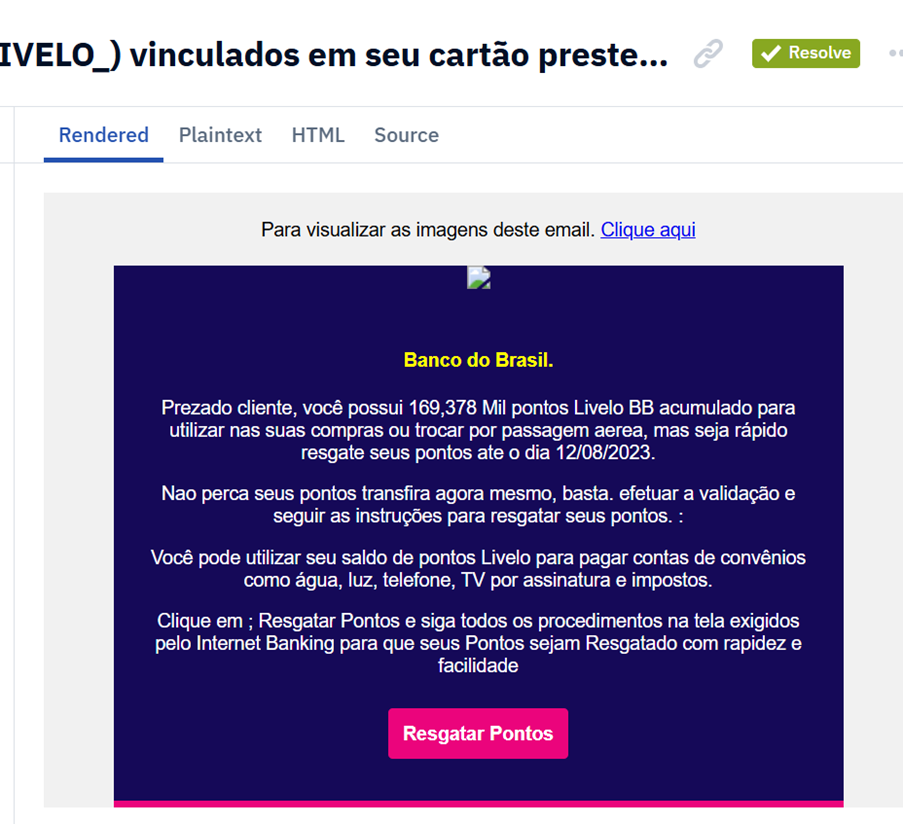

Subject: |BANCODOBRASIL|/

This email appears to impersonate Banco do Brasil Bank, attempting to trick the recipient into clicking a suspicious link. It uses stylized formatting in the subject to look official and bypass simple spam filters. There’s no personal salutation or proper branding, and it arrives from a highly questionable server identity.

  

1. Header Analysis

From: b077195@bbatendimento.lb
The email pretends to be from Banco do Brasil, but the domain bbatendimento.lb is not associated with the bank. In fact, the .lb domain is Lebanese, which raises suspicion when tied to a Brazilian institution.

 
 

Display Name: \|BANCO*DO*BRASIL|/
The use of special characters is a common trick to bypass spam filters and catch the recipient’s eye, but no legitimate bank uses that format.

 
 
Return-Path: root@centos-s-1vcpu-1gb-35gb-intel-nyc3-10.localdomain
This is a big red flag. The message is being sent from a generic, default Linux system hostname (localhost.localdomain) ,typical of compromised or freshly used servers used in phishing.

  

Originating IP: 159.203.104.14
This IP is tied to DigitalOcean infrastructure (New York), not a bank’s mailing infrastructure.
rDNS: None.
No reverse DNS — another indicator this is not a verified sender.

 

 
Email Security

 
 
•	SPF: None
No SPF record was configured. This means anyone can send emails from this domain without restriction.

•	DKIM: None
No DKIM signatures were found — another key authentication mechanism missing. The message could have been altered in transit, and the sender isn’t verified.

•	DMARC: None
Without DMARC, spoofed emails from this domain won’t be rejected or flagged by receiving mail servers.

2. Content of the Email

Subject: \|BANCO*DO*BRASIL|/

The subject is stylized in a way that mimics a financial institution, but this formatting is highly suspicious. No legitimate bank uses a pipe (|), asterisks (*), or slashes (/) in formal communication.

Message Body:.
Message Body (translated from Brazilian Portuguese) using the Google Translate tool

To view the images in this email, click here
Banco do Brasil.
Dear customer, you have 169,378 thousand Livelo BB points accumulated to use on your purchases or exchange for airline tickets, but act quickly — redeem your points by August 12, 2023.
Don't lose your points — transfer them now. Just validate and follow the instructions to redeem your points.
You can use your Livelo points balance to pay utility bills such as water, electricity, telephone, cable TV, and taxes.
Click on "Redeem Points" and follow all the steps shown on screen through Internet Banking so that your points can be redeemed quickly and easily.
Redeem Points

This message plays on urgency and reward — classic social engineering. It uses:
•	Psychological bait (threat of losing points),

 Fake urgency: “act quickly,” “don’t lose your points,” and a fixed expiration date are designed to pressure users into clicking.
  Fake reward: Suggests you’re entitled to a large number of points (169,378 thousand which is weird).
 Call-to-action: “Redeem Points” invites the victim to click a malicious link.
•  Familiar utilities listed: water, electricity, taxes — to make the message feel legitimate and relatable.

3. Attachment / Link
•	Attachment: None
•	URL in message:
o	Domain: mykisel.com
o	Path: /assets/js/pages/jss/
o	Scheme: HTTP (no HTTPS — unsafe)
o	Port: 80
o	VirusTotal: 0/90 (no engines flagged it yet — but this doesn’t make it safe)

 

The domain doesn’t relate to any banking institution and is clearly used as a drop site for a malicious payload or credential harvesting page.

4. Behaviour and 

 
 
•	Likely impersonates a trusted bank (Banco do Brasil).
•	Sent from a non-commercial VPS or test server.
•	Uses basic obfuscation in the subject and a shady-looking link in the body.
•	No personalization — suggesting this is a mass phishing campaign, not a targeted spear-phishing attempt.
•	It impersonates Banco do Brasil bank, which uses yellow and blue as company colors. This can make the email appear visually legitimate to unsuspecting users, increasing the chances of interaction.
•	Includes an image tag or HTML file that fails to load, likely meant to imitate the bank’s branding — another common tactic used in phishing kits that are sloppily implemented.

Final Reports
This is a blatant phishing attempt, relying on impersonation, poor domain security, and a likely malware-hosting or credential-harvesting link.
Red Flags:
•	Sender domain unrelated to Banco do Brasil (bbatendimento.lb)
•	Display name with special characters to appear official
•	No SPF, DKIM, or DMARC — no authentication at all
•	Suspicious server (localhost.localdomain) in Return-Path
•	IP has no reverse DNS — likely a cloud instance, not an email server
•	Dangerous link to mykisel.com (no HTTPS, in JS asset folder)
•	Email mimics Banco do Brasil’s color theme and includes broken images, suggesting a poorly configured phishing kit.

Final Verdict:  This a Malicious email

